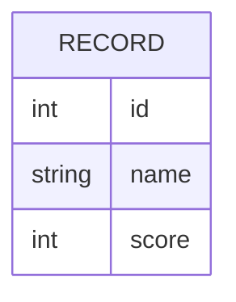

# Domain Model

A single entity is in play: the scored record Service2 catalogs and Service1 averages.

`RECORD` — one row of Service2's catalog. Service2 serves either the fixed set of ten
records (full mode) or none at all (empty mode); Service1 never stores a record, it
only reads the current set from Service2 for each average computation.